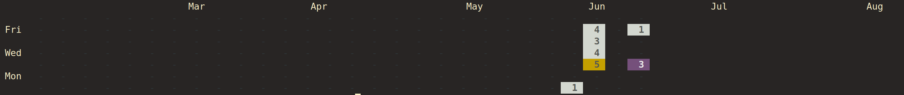

# Local Git contributions tracker
This is a project done by following the tutorial from [flaviocopes](https://flaviocopes.com/go-git-contributions/), full credit for the concept and code goes to them. Please check out the tutorial for a better explanation of how the code functions and give them all your love and support. 

## Table of contents

- [Overview](#overview)
  - [The challenge](#the-challenge)
  - [Screenshot](#screenshot)
  - [Links](#links)
  - [What I learned](#what-i-learned)

## Overview
This program lets you add the folders containing the rpositories which you want to track using the "-add" terminal flag, and shows you the contribution when you give it the user's email using the "-email" flag. This project relies on the [go-git](https://github.com/go-git/go-git) package for its repository handling. Please don't forget to check out [Flaviocopes](https://flaviocopes.com/) for the full tutorial.
### The challenge

Users should be able to:

- Add the repositories the user wants to track
- Print the contributions as a graph similar to the one found on GitHub

### Screenshot

### Links

- [Flaviocopes](https://flaviocopes.com/)
- [go-git package](https://github.com/go-git/go-git)
- [flags package](https://pkg.go.dev/flag)

### What I learned

I learned a lot about file and folder handling in Go; how to open directories and recursively look for files in them, and how to write and read from files. I also learned how to handle Git repositories using the go-git package and how to use ANSI escape sequences like the "ESC [" sequence.

